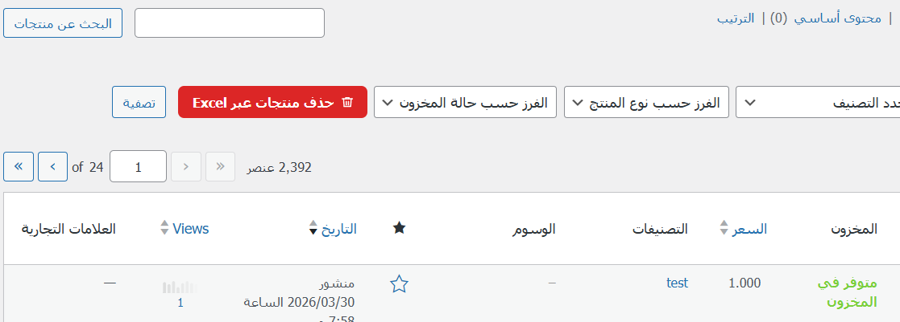
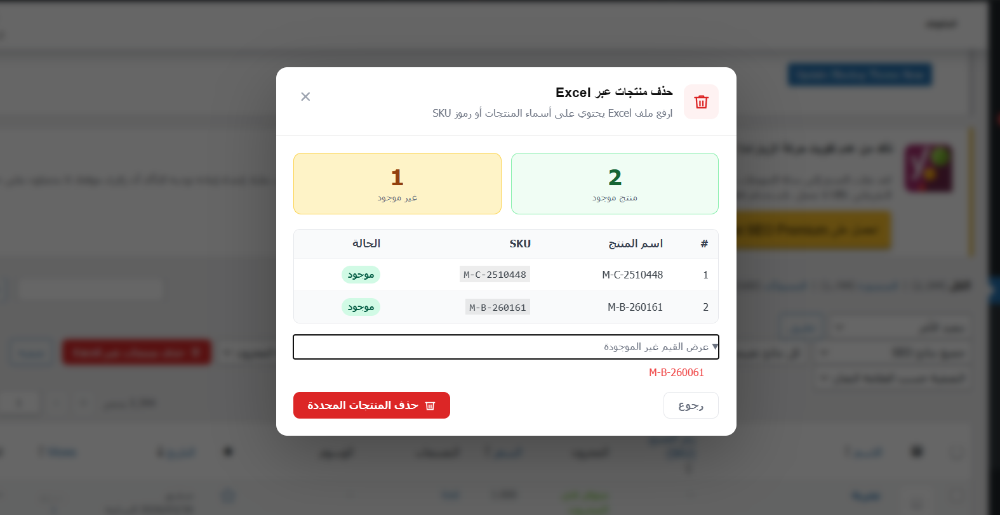

=== Bulk Product Delete via Excel ===
Contributors:      yourname
Tags:              woocommerce, products, bulk delete, excel
Requires at least: 5.8
Tested up to:      6.5
Requires PHP:      7.4
Stable tag:        1.0.0
License:           GPLv2 or later

حذف منتجات WooCommerce بشكل جماعي عبر رفع ملف Excel.

== Description ==

يضيف هذا البرنامج المساعد زراً في صفحة المنتجات بلوحة تحكم WooCommerce
يتيح لك رفع ملف Excel (.xlsx / .xls) يحتوي على:
- أسماء المنتجات، أو
- رموز SKU

ثم يعرض قائمة بالمنتجات المطابقة قبل الحذف للمراجعة والتأكيد.

**المميزات:**
* لا يتطلب أي مكتبات خارجية — يعمل بـ PHP النقية
* دعم .xlsx و .xls
* يتيح اختيار رقم العمود في ملف Excel
* معاينة كاملة قبل الحذف (أسماء + SKU)
* يعرض القيم غير الموجودة
* حذف نهائي مع تنظيف cache WooCommerce
* واجهة عربية بالكامل

== Installation ==

1. ارفع مجلد `bulk-product-delete` إلى `/wp-content/plugins/`
2. فعّل الإضافة من لوحة التحكم › إضافات
3. انتقل إلى WooCommerce › المنتجات
4. ستجد زر "حذف منتجات عبر Excel" في أعلى الصفحة

== Frequently Asked Questions ==

= هل الحذف نهائي؟ =
نعم، يتم الحذف النهائي (force delete) متجاوزاً سلة المهملات.

= ما الحد الأقصى لحجم الملف؟ =
يعتمد على إعداد `upload_max_filesize` في PHP. الافتراضي 10 ميغابايت.

= هل يدعم المتغيرات (variations)؟ =
عند الحذف بالاسم: يبحث في المنتجات الرئيسية فقط.
عند الحذف بـ SKU: يدعم المتغيرات لأن كل variation لها SKU مستقل.

== Changelog ==

= 1.0.0 =
* الإصدار الأول

# Bulk Product Delete via Excel 🚀

**إضافة ووردبريس لحذف منتجات WooCommerce بشكل جماعي عبر رفع ملف Excel.**

---

## 📸 شرح الإضافة (Screenshots)

### 1️⃣ واجهة الرفع
عند الدخول إلى صفحة المنتجات، ستجد خيار رفع ملف Excel

  

### 2️⃣  رفع ملف Excel وتحديد الخيارات
 اختيار نوع البيانات (الاسم أو SKU) وتحديد رقم العمود.
 

  

### 3️⃣ معاينة المنتجات قبل الحذف
تقوم الإضافة بفحص الملف وعرض المنتجات المطابقة والمنتجات غير الموجودة لمراجعتها بدقة قبل اتخاذ قرار الحذف.

  

### 4️⃣ تأكيد الحذف النهائي
بعد التأكيد، يتم حذف المنتجات نهائياً من قاعدة البيانات مع تنظيف التخزين المؤقت لضمان تحديث المتجر فوراً.

  

---

## 📝 وصف الإضافة
يضيف هذا البرنامج المساعد زراً في صفحة المنتجات بلوحة تحكم WooCommerce يتيح لك رفع ملف Excel (.xlsx / .xls) يحتوي على أسماء المنتجات أو رموز SKU، ثم يعرض قائمة بالمنتجات المطابقة قبل الحذف للمراجعة والتأكيد.

### ✨ المميزات:
* **خفيف وسريع:** لا يتطلب أي مكتبات خارجية — يعمل بـ PHP النقية.
* **دعم شامل:** يدعم صيغ `.xlsx` و `.xls`.
* **مرونة عالية:** يتيح اختيار رقم العمود في ملف Excel.
* **أمان ودقة:** معاينة كاملة قبل الحذف (أسماء + SKU) مع عرض القيم غير الموجودة.
* **تنظيف كامل:** حذف نهائي مع تنظيف cache WooCommerce.
* **واجهة عربية:** مصمم بالكامل ليدعم اللغة العربية.

---

## ⚙️ التثبيت (Installation)
1. قم بتحميل المجلد وارفع `bulk-product-delete` إلى المسار التالي: `/wp-content/plugins/`
2. فعّل الإضافة من لوحة التحكم › إضافات.
3. انتقل إلى **WooCommerce** › **المنتجات**.
4. ستجد زر **"حذف منتجات عبر Excel"** في أعلى الصفحة.

---

## ❓ الأسئلة الشائعة (FAQ)

**هل الحذف نهائي؟**
نعم، يتم الحذف النهائي (force delete) متجاوزاً سلة المهملات.

**ما الحد الأقصى لحجم الملف؟**
يعتمد على إعداد `upload_max_filesize` في PHP على سيرفرك (الافتراضي غالباً 10 ميغابايت).

**هل يدعم المتغيرات (variations)؟**
* عند الحذف بالاسم: يبحث في المنتجات الرئيسية فقط.
* عند الحذف بـ SKU: يدعم المتغيرات لأن كل variation لها SKU مستقل.

---

## 🛠 المتطلبات التقنية
* **نسخة ووردبريس:** 5.8 أو أعلى.
* **نسخة PHP:** 7.4 أو أعلى.
* **الترخيص:** GPLv2 or later.

